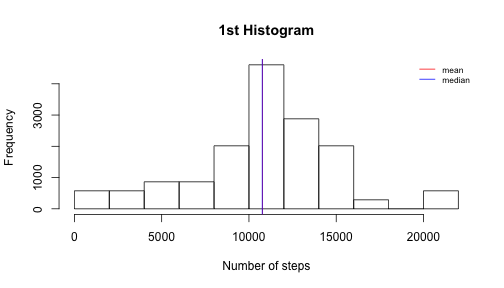
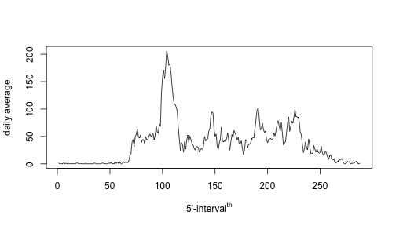
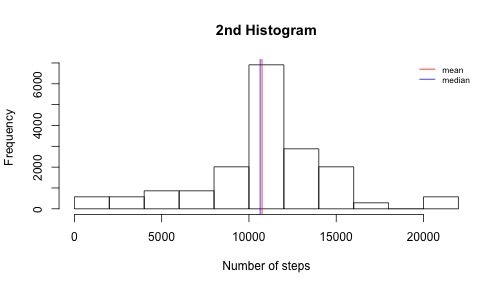
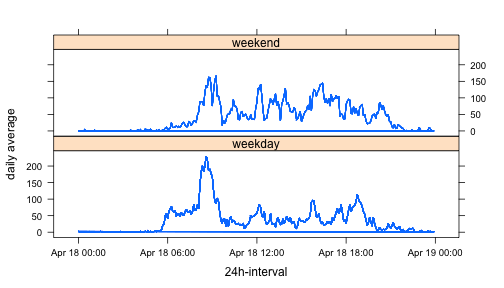

TITLE: "PA1_template"
===============================================================================
### author: "Sabank"
### date: "April 16, 2015", output: html_document

This assignment makes use of data from a personal activity monitoring device.
This device collects data at 5 minute intervals through out the day (24h). The
data consists of two months of data from an anonymous individual collected
during the months of October and November, 2012 and include the number of steps
taken in 5 minute intervals each day.

## 1. LOAD DATA

```r
# download url
fileUrl <- "https://d396qusza40orc.cloudfront.net/repdata%2Fdata%2Factivity.zip"
zipfileName <- "repdata-data-activity.zip"
download.file (fileUrl, zipfileName, "curl")
# unzip file
unzip(zipfileName, junkpaths = TRUE)
# keep track of date of the download
dateDownloaded <- Sys.Date()
```
This file was last downloaded 2015-04-18

## 2. DATA PROCESSING

```r
# read csv file and update formats for analysis
file <- read.csv("activity.csv", header=TRUE, sep =",", na.strings = "NA",
                 colClasses = c("numeric", "character", "character"))
# update date (i.e column 'date')
file$date <- as.Date(file$date, "%Y-%m-%d")
# update time (i.e column 'interval')
for (i in 1:length(file$interval)){
    if (nchar(file$interval[i]) == 1) {
        file$interval[i] <- paste0("00:0", file$interval[i], ":00")
    } else if (nchar(file$interval[i]) == 2) {
        file$interval[i] <- paste0("00:", file$interval[i], ":00")
    } else if (nchar(file$interval[i]) == 3) {
        l1 <- substring(file$interval[i], 1, 1)
        l2 <- substring(file$interval[i], 2)
        file$interval[i] <- paste0("0", l1 , ":", l2, ":00")
    } else {
        l1 <- substring(file$interval[i], 1, 2)
        l2 <- substring(file$interval[i], 3)
        file$interval[i] <- paste0(l1 , ":", l2, ":00")
    }
}
#file$interval <- as.POSIXct(paste(file$date, file$interval), format= "%Y-%m-%d %H:%M:%S")
# load libraries
library(ggplot2)
```

```
## Warning: package 'ggplot2' was built under R version 3.1.3
```

```r
library(lattice)
```

```
## Warning: package 'lattice' was built under R version 3.1.3
```

### 2.1 What is mean total number of steps taken per day?

```r
# subset without NA
data <- file[!is.na(file$steps),]
# compute daily total steps 'dts'
data$dts <- tapply(data$steps, data$date, sum)
# statistics
summary(data$dts)
```

```
##    Min. 1st Qu.  Median    Mean 3rd Qu.    Max. 
##      41    8841   10760   10770   13290   21190
```


```r
hist(data$dts, main = "1st Histogram", xlab = "Number of steps", breaks=10)
# draw the mean and median
abline(v=10770, col="Red", lwd = 1)
abline(v=10760, col="Blue", lwd = 1)
legend ("topright", lty = 1, col = c("Red","Blue"), legend = c("mean","median"),
        bty = "n", cex = 0.7)
```

 

### 2.2 What is the average daily activity pattern?

```r
# from subset without NA,
# compute average steps per interval 'dtm' across all days
dtm <- tapply(data$steps, data$interval, mean)
```


```r
plot(dtm, type="l", xlab=bquote("5'-interval"^th), ylab="daily average")
```

 

```r
# statistics
summary(dtm)
```

```
##    Min. 1st Qu.  Median    Mean 3rd Qu.    Max. 
##   0.000   2.486  34.110  37.380  52.830 206.200
```


```r
which.max(dtm)
```

```
## 08:35:00 
##      104
```
The interval 104 has the higher number of steps

### 2.3 Imputing missing values
The number of missing values is NA's   :2304  
Replacement strategy consist of using computed average across all days values
'dtm' in lieu of NA for the same 5'-interval.

```r
# replacement of NAs by average value across all days
newfile <- file
for (i in 1:length(dtm)){
    newfile$steps[which(is.na(newfile$steps)
                        & (newfile$interval == names(dtm[i])))] <- floor(dtm[i])
}
# compute daily total steps 'dts'
newfile$dts <- tapply(newfile$steps, newfile$date, sum)
# statistics
summary(newfile$dts)
```

```
##    Min. 1st Qu.  Median    Mean 3rd Qu.    Max. 
##      41    9819   10640   10750   12810   21190
```


```r
hist(newfile$dts, main = "2nd Histogram", xlab = "Number of steps", breaks=10)
# draw the mean and median
abline(v=10750, col="Red", lwd = 1)
abline(v=10640, col="Blue", lwd = 1)
legend ("topright", lty = 1, col = c("Red","Blue"), legend = c("mean","median"),
        bty = "n", cex = 0.7)
```

 

### 2.4 Are there differences in activity patterns between weekdays and weekends?

```r
# create new variable 'daytype', compute and factor type of day
newfile$daytype <- weekdays(newfile$date)
for (i in 1:length(newfile$daytype)){
    if (newfile$daytype[i] == "Saturday" | newfile$daytype[i] == "Sunday"){
        newfile$daytype[i] <- "weekend"
    } else {
        newfile$daytype[i] <- "weekday"
    }
}
newfile <- transform(newfile, daytype = factor(daytype))
# compute average steps per interval 'dtm' across weekdays or weekends
newfile$dtm <- NA
newfile$dtm[which(newfile$daytype == "weekend")] <- tapply(newfile$steps[which(newfile$daytype == "weekend")],
                                                           newfile$interval[which(newfile$daytype == "weekend")],
                                                           mean)
newfile$dtm[which(newfile$daytype == "weekday")] <- tapply(newfile$steps[which(newfile$daytype == "weekday")],
                                                           newfile$interval[which(newfile$daytype == "weekday")],
                                                           mean)
# format time in numeric
newfile$interval <- as.POSIXct(as.character(newfile$interval), format= "%H:%M:%S")
```


```r
xyplot(dtm~interval|daytype, data=newfile, type="l", layout=c(1,2),
       xlab="24h-interval", ylab="daily average")
```

 
